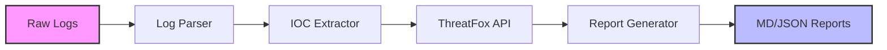
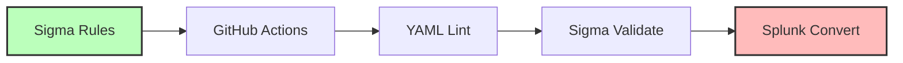

# 🛡️ SOAR — Security Orchestration, Automation & Response


An automated Security Operations and Automation Response (SOAR) framework implementing Detection-as-Code. This project streamlines incident response by utilizing Sigma rules for cross-platform threat detection, automated threat intelligence enrichment via the ThreatFox API, and automated incident reporting.

##  Architecture





##  Project Structure

```
SOAR/
├── .github/
│   └── workflows/
│       └── sigma-validation.yml
├── reports/
│   └── .gitkeep
├── sample_logs/
│   └── sysmon_events.json
├── sigma-rules/
│   └── (Sigma rule YAML files)
├── tests/
│   └── validate_sigma.py
├── .yamllint.yml
├── README.md
└── requirements.txt
```

##  Quick Start

1. **Clone the repository:**
   ```bash
   git clone https://github.com/yourusername/SOAR.git
   cd SOAR
   ```

2. **Install dependencies:**
   ```bash
   pip install -r requirements.txt
   pip install pyyaml
   ```

3. **Run local validation on Sigma rules:**
   ```bash
   python tests/validate_sigma.py
   ```

## 📋 Sigma Detection Rules

| Rule File | Technique | Description | Severity |
|-----------|-----------|-------------|----------|
| `proc_creation_encoded_ps.yml` | Obfuscated Files/Info | Detects encoded PowerShell commands | High |
| `network_powershell_c2.yml` | Web Protocol | Detects PowerShell network connections | Critical |
| `proc_creation_amsi_bypass.yml` | Impair Defenses | Detects AMSI bypass attempts | High |

##  CI/CD Pipeline

The GitHub Actions pipeline enforces Detection-as-Code standards through 3 automated stages:

1. **yaml-lint**: Ensures all Sigma rules conform to the standard YAML formatting defined in `.yamllint.yml`.
2. **sigma-validate**: Uses `sigma-cli` to check the validity of the rule syntax, field requirements, and logic.
3. **sigma-convert-splunk**: Acts as a smoke test by converting validated rules into Splunk queries using `pySigma-backend-splunk`.

##  SOAR Engine

The core engine automatically parses incoming logs (like Sysmon events), extracts potential Indicators of Compromise (IOCs), queries them against threat intelligence platforms (e.g., ThreatFox), and orchestrates an automated response workflow.

##  Report Output

Incident response reports are generated in Markdown and JSON formats. Example JSON IR snippet:

```json
{
  "incident_id": "INC-2023-10-27-01",
  "timestamp": "2023-10-27T08:27:10.000Z",
  "severity": "CRITICAL",
  "detected_iocs": [
    {
      "type": "ip",
      "value": "203.0.113.50",
      "threat_score": 98,
      "tags": ["cobalt-strike", "c2"]
    }
  ],
  "mitre_tactics": ["Execution", "Command and Control"]
}
```

##  MITRE ATT&CK Coverage

| Technique ID | Name | Tactic | Sigma Rule |
|--------------|------|--------|------------|
| T1059.001 | PowerShell | Execution | `sysmon_powershell_execution.yml` |
| T1562.001 | Disable or Modify Tools | Defense Evasion | `proc_creation_amsi_bypass.yml` |
| T1027 | Obfuscated Files or Information | Defense Evasion | `proc_creation_encoded_ps.yml` |
| T1071.001 | Web Protocol | Command and Control | `network_powershell_c2.yml` |

##  Contributing

Contributions are welcome! Please ensure all new Sigma rules pass the local validation script (`python tests/validate_sigma.py`) before submitting a pull request.

## 📄 License

This project is licensed under the MIT License - see the LICENSE file for details.
